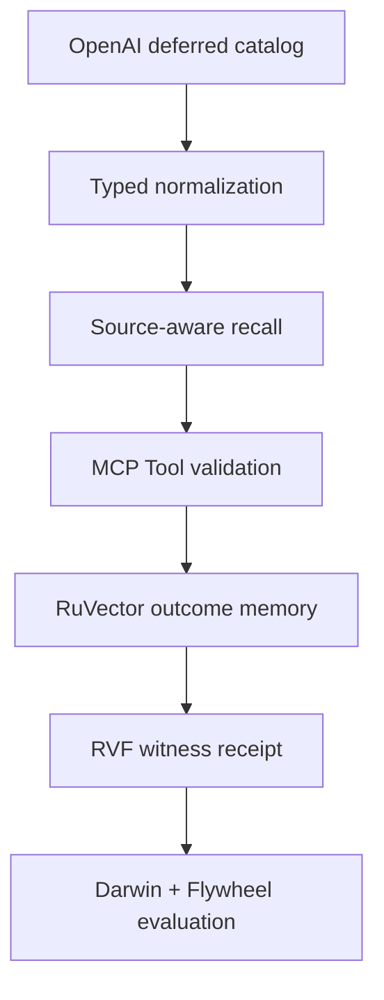
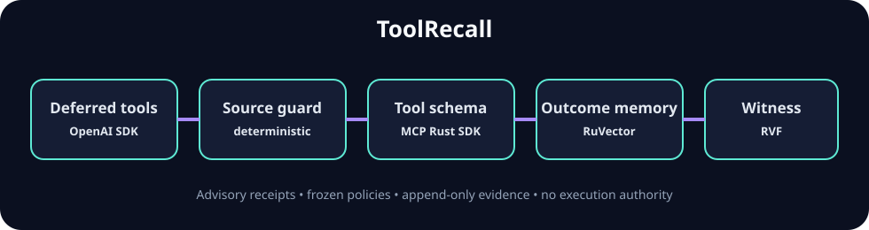

<p align="center">
  <a href="https://www.rust-lang.org/"></a>&nbsp;
  <a href="https://openai.github.io/openai-agents-python/"></a>&nbsp;
  <a href="https://modelcontextprotocol.io/"></a>&nbsp;
  <a href="https://github.com/ruvnet/ruvector"></a>&nbsp;
  <a href="https://github.com/ruvnet/metaharness"></a>
</p>

# ToolRecall

ToolRecall is a source-aware recall firewall for deferred agent tool catalogs. It detects when lexical retrieval silently omits a tool source, expands only the missing source, validates selected tools through the official MCP Rust model, and binds the selection, catalog snapshot, RuVector readback, and RVF witness into an inspectable receipt.

> **Maturity:** experimental research build. It is advisory, grants no authority, and must not auto-promote a policy.



## Thesis

A global top-k tool search can look accurate while collapsing one entire source. A planning system should therefore gate tool recall on declared source obligations before exposing the selected catalog to a model.

## Quickstart

```bash
python3 -m venv .venv
.venv/bin/pip install openai-agents==0.3.3
cargo run --locked -- --query "has invoice 77 been paid" --required-source billing --required-tool get_invoice_status --python .venv/bin/python
cargo run --locked -p toolrecall-evaluation -- --json
```

Example output contains `selected`, `missing_sources`, `catalog_digest`, `memory_readback`, and `rvf_witness`. The process exits non-zero for invalid policies, malformed sidecar data, timeouts, failed MCP validation, or failed evidence persistence.

## Capabilities

- loads real `@function_tool(defer_loading=True)` definitions through the OpenAI Agents SDK;
- validates normalized tools with `rmcp::model::Tool` from the official MCP Rust SDK;
- compares `global-top-k`, `source-guard`, and `full-catalog` on one frozen corpus;
- persists and reads back outcome vectors using `ruvector-core::VectorDB`;
- chains an RVF witness over the exact catalog and decision digests;
- emits deterministic JSON for MetaHarness Darwin and Flywheel evaluation.

## Workspace map

| Package | Responsibility |
|---|---|
| `toolrecall-domain` | catalog, query, policy, strategies, receipts and metrics |
| `toolrecall-application` | orchestration and typed ports |
| `toolrecall-adapter-openai` | bounded Python sidecar for deferred OpenAI tools |
| `toolrecall-adapter-mcp` | official MCP `Tool` validation |
| `toolrecall-adapter-ruvnet` | real RuVector storage/readback and RVF witness |
| `toolrecall-evaluation` | frozen corpus, baselines, ablations and evaluator candidate |
| root CLI | complete vertical slice |

## Upstream composition

| Ingredient | Pinned interface | Executed role |
|---|---|---|
| OpenAI Agents SDK | `openai-agents==0.3.3` | materialize deferred function tools |
| MCP Rust SDK | `rmcp 3.4.0` | schema/name validation |
| RuVector | `ruvector-core 2.3.1` | append/readback outcome vectors |
| RVF | `rvf-crypto 0.2.0` | witness-chain decision evidence |
| MetaHarness | Darwin `0.10.3`, Flywheel `0.1.12` | bounded candidate scoring and replay verification |

## Evidence

The reproducible evaluation compares source coverage, target recall, catalog exposure, and invalid receipts. Raw command outputs are committed under [`evidence/`](evidence/). No production-performance claim is made.

See the [architecture](docs/architecture.md), [specification](docs/specification.md), [ADRs](docs/adrs/README.md), [DDD corpus](docs/ddd/README.md), [traceability](docs/traceability.md), and [limitations](PROJECT_STATUS.md).



## Security and limitations

- Source obligations are policy input; they are not inferred by an LLM.
- Lexical overlap is a deterministic experimental kernel, not a semantic retriever.
- RuVector data are local experimental evidence; production persistence must remain behind authorized ACL interfaces.
- The OpenAI sidecar loads SDK objects but performs no network model call.
- ToolRecall recommends; it cannot execute tools, publish, deploy, or expand its authority.

Licensed under Apache-2.0.
