<p align="center">
  <a href="https://www.rust-lang.org/"></a>&nbsp;&nbsp;
  <a href="https://openai.github.io/openai-agents-python/"></a>&nbsp;&nbsp;
  <a href="https://modelcontextprotocol.io/"></a>&nbsp;&nbsp;
  <a href="https://github.com/ruvnet/ruvector"></a>&nbsp;&nbsp;
  <a href="https://github.com/ruvnet/metaharness"></a>
</p>

<p align="center">
  <a href="#quickstart">Quickstart</a> ·
  <a href="#architecture">Architecture</a> ·
  <a href="#evidence">Evidence</a> ·
  <a href="docs/adrs/README.md">ADRs</a> ·
  <a href="docs/ddd/README.md">DDD</a> ·
  <a href="PROJECT_STATUS.md">Status</a>
</p>

<a href="#architecture"></a>

# ToolRecall

ToolRecall is a source-aware recall firewall for deferred agent tool catalogs. It detects when lexical retrieval silently omits a tool source, expands only the missing source, validates selected tools through the official MCP Rust model, and binds catalog, decision, memory readback, and RVF witness into an inspectable receipt.

> **Maturity:** experimental research build. ToolRecall is advisory, grants no execution authority, and cannot promote a policy.

## Why it exists

A global top-k search can look accurate while collapsing an entire source. ToolRecall makes required-source coverage a typed admission invariant before any selected catalog is exposed downstream. The research mechanism is falsifiable: it fails if source guard misses a required source, loses target recall against full catalog, or expands to full-catalog exposure on every case.

## Quickstart

```bash
python3 -m venv .venv
.venv/bin/pip install openai-agents==0.23.1

cargo run --locked -- \
  --query "has invoice 77 been paid" \
  --required-source billing \
  --required-tool get_invoice_status \
  --python .venv/bin/python

cargo run --locked -p toolrecall-evaluation \
  --bin toolrecall-benchmark -- --json
```

The CLI emits typed JSON containing `selected`, `missing_sources`, `catalog_digest`, `memory_readback`, `rvf_witness`, and `authority`. It exits non-zero for invalid policy, malformed sidecar data, timeout, MCP validation failure, evidence persistence failure, or witness mismatch.

<details>
<summary><strong>Realistic output shape</strong></summary>

```json
{
  "strategy": "source-guard",
  "selected": ["billing.get_invoice_status"],
  "missing_sources": [],
  "memory_readback": true,
  "rvf_witness": "verified",
  "authority": "none"
}
```

Values are illustrative; committed evidence is the source of measured results.
</details>

## Architecture

<a href="docs/architecture.md"></a>

The two SVGs are script-free, self-contained, readable when animation is stopped, and include reduced-motion behavior. They illustrate implemented flow, not live telemetry. Asset provenance is recorded in [`docs/assets/ATTRIBUTION.md`](docs/assets/ATTRIBUTION.md).

| Package | Responsibility | Dependency direction |
|---|---|---|
| `toolrecall-domain` | catalog, query, source obligations, strategies, receipts, metrics | depends on no adapter |
| `toolrecall-application` | orchestration and typed ports | domain only |
| `toolrecall-adapter-openai` | bounded Python sidecar for deferred OpenAI tools | application port |
| `toolrecall-adapter-mcp` | official MCP `Tool` validation | application port |
| `toolrecall-adapter-ruvnet` | RuVector storage/readback and RVF witness | application port |
| `toolrecall-evaluation` | frozen corpus, baselines, ablations, evaluator candidate | public domain/application APIs |
| root CLI | validated input and complete vertical slice | composes all adapters |

## Executed upstream composition

| Ingredient | Pin | Executed contribution | Evidence path |
|---|---|---|---|
| OpenAI Agents SDK | `openai-agents==0.23.1` | materializes real `defer_loading=True` tools in the sidecar | integration test + CLI receipt |
| MCP Rust SDK | `rmcp 3.4.0` | validates names and schemas through the official Rust model | MCP adapter tests |
| RuVector | source `5a93328…`, crate `2.3.1` | inserts outcome vectors and asserts readback | Ruvnet adapter test |
| RVF | `rvf-crypto 0.2.0` | chains catalog and decision digests; rejects tampering | witness tests |
| MetaHarness | Darwin `0.10.3`, Flywheel `0.1.12` | scores bounded candidates and verifies replay bundles | evaluator evidence; `authority: none` |

Dependencies are present for executed behavior, not branding. The maintained OpenAI SDK is Python, so its integration is an explicit, typed sidecar boundary; MCP, RuVector, and RVF use Rust APIs.

## Evidence

The frozen six-case corpus compares global top-k, source guard, and full catalog under one dataset, seed, and implementation snapshot.

| Strategy | Required-source coverage | Target recall | Average tools exposed |
|---|---:|---:|---:|
| Global top-k | 0.667 | 1.000 | 1.000 |
| Source guard | 1.000 | 1.000 | 2.167 |
| Full catalog | 1.000 | 1.000 | 8.000 |

Darwin selected `top_k=1,max_loaded=2` at `0.9600`, versus a `0.9567` baseline. Flywheel replay verified the receipt/authenticity checks with `authority: none`. These are mechanism results on a small lexical corpus, not production-performance claims.

Reproduce the quality gates:

```bash
cargo fmt --all -- --check
cargo clippy --workspace --all-targets --all-features --locked -- -D warnings
cargo test --workspace --all-targets --all-features --locked
cargo deny check
cargo run --locked -- --query "has invoice 77 been paid" \
  --required-source billing --required-tool get_invoice_status \
  --python .venv/bin/python
cargo run --locked -p toolrecall-evaluation --bin toolrecall-benchmark -- --json
```

Raw command outputs, evaluator receipts, baselines, failed attempts, and environment details are committed under [`evidence/`](evidence/). Exact merged-main CI is [run 37559009063](https://github.com/nicholas-ruest/toolrecall/actions/runs/37559009063).

## Design record

- [Specification](docs/specification.md)
- [Architecture](docs/architecture.md)
- [25 decision-specific ADRs](docs/adrs/README.md)
- [12 DDD documents](docs/ddd/README.md)
- [Implementation contract](docs/implementation-contract.md)
- [Acceptance traceability](docs/traceability.md)
- [Research and candidate comparison](docs/research.md)

## Security and limitations

- Source obligations are explicit policy input; an LLM does not invent them.
- The lexical kernel is deliberately bounded and is not a semantic retriever.
- RuVector files are local evaluation evidence; production persistence must remain behind authorized RuVector/Cloud SQL interfaces.
- The OpenAI sidecar loads SDK objects but performs no network model call.
- Evaluators may propose and score; they cannot execute tools, publish, deploy, or expand authority.
- Public research and build Gists remain separate completion gates tracked in [PROJECT_STATUS.md](PROJECT_STATUS.md).

Licensed under Apache-2.0.
