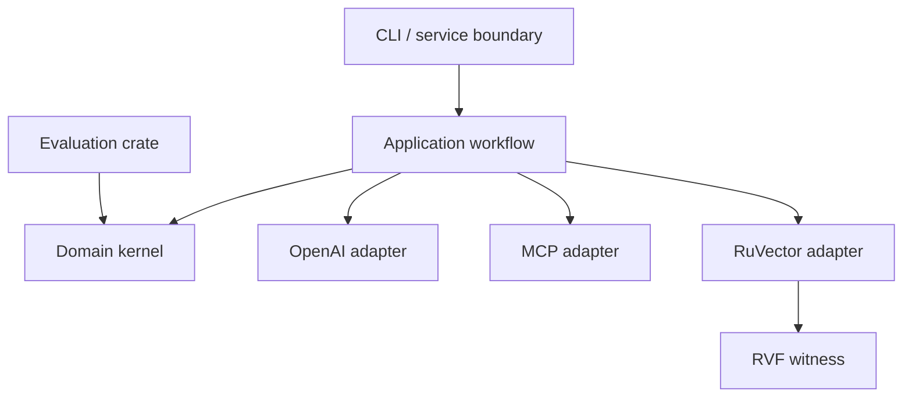

# Architecture

ToolRecall uses a hexagonal architecture so the deterministic recall policy remains independent of SDK and storage lifecycles.

## Dependency direction

The domain has no adapter dependency. Application depends on domain and defines ports. Adapters implement those ports and use pinned upstream packages. The root CLI is the composition root. Evaluation imports the domain contract but cannot promote a candidate.

## Complete vertical slice

1. The CLI validates bounded JSON input.
2. The OpenAI Python sidecar constructs real deferred `FunctionTool` objects and emits their schemas.
3. The application normalizes and hashes the catalog.
4. The selected strategy runs against that immutable snapshot.
5. The MCP adapter creates official `rmcp::model::Tool` instances for each selected item.
6. The RuVector adapter appends a decision vector and performs an exact ID readback.
7. RVF chains catalog and decision digests into a witness.
8. The CLI emits the joined receipt or exits non-zero.

## Failure containment

The sidecar is killed on timeout; no partial catalog is accepted. Missing sources, duplicate IDs, malformed schemas, failed readbacks, or witness failures prevent a success receipt. Evidence is local and append-only. Production Cloud SQL/RuVector wiring remains an explicit deployment adapter outside this research build.

## Trust boundaries

Catalog text is untrusted. JSON is parsed with bounded input and typed structs. Tools gain no authority by appearing in the catalog. Evaluators may score a strategy but cannot merge, publish, deploy, or alter policy bounds.
