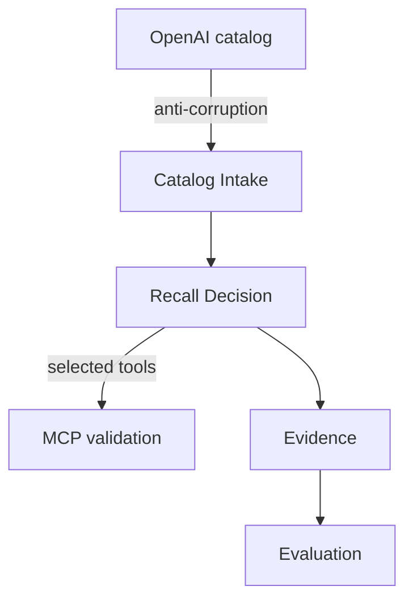

# Context map

Catalog Intake publishes the canonical snapshot. Recall Decision consumes it and owns policy invariants. MCP validation is a conformist adapter to the official schema. Evidence translates receipts into RuVector entries and RVF witnesses. Evaluation consumes immutable receipts and may recommend, never promote.

Ownership is enforced by crate dependencies: domain owns the aggregate, application owns ports, adapters own upstream translation, and the CLI owns composition.
